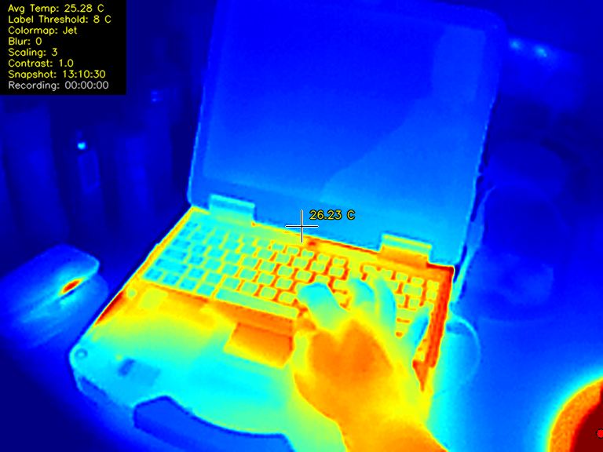

# PyThermalcam
Python Software to use the Topdon TC001 Thermal Camera on Linux and the Raspberry Pi

Huge kudos to LeoDJ on the EEVBlog forum for reverse engineering the image format from these kind of cameras (InfiRay P2 Pro) to get the raw temperature data!
https://www.eevblog.com/forum/thermal-imaging/infiray-and-their-p2-pro-discussion/200/
Check out Leo's Github here: https://github.com/LeoDJ/P2Pro-Viewer/tree/main

***Introduction***

This is a quick and dirty Python implimentation of Thermal Camera software for the Topdon TC001!
(https://www.amazon.co.uk/dp/B0BBRBMZ58)
No commands are sent the the camera, instead, we take the raw video feed, do some openCV magic, and display a nice heatmap along with relevant temperature points highlighted.

This program, and associated information is Open Source (see Licence), but if you have gotten value from these kinds of projects and think they are worth something, please consider donating: https://paypal.me/leslaboratory?locale.x=en_GB This project is a follow on from: https://github.com/leswright1977/PySpectrometer

This readme is accompanied by youtube videos. Visit my Youtube Channel at: https://www.youtube.com/leslaboratory

***Features***

Include image of colormaps

***Key Bindings***

Tested on Debian all features are working correctly
This will work on the Pi However a number of workarounds are implemented!
Seemingly there are bugs in the compiled version of cv2 that ships with the Pi!

Key Bindings:

a z: Increase/Decrease Blur
s x: Floating High and Low Temp Label Threshold
d c: Change Interpolated scale Note: This will not change the window size on the Pi
f v: Contrast
q w: Fullscreen Windowed (note going back to windowed does not seem to work on the Pi!)
r t: Record and Stop
m : Cycle through ColorMaps
h : Toggle HUD
